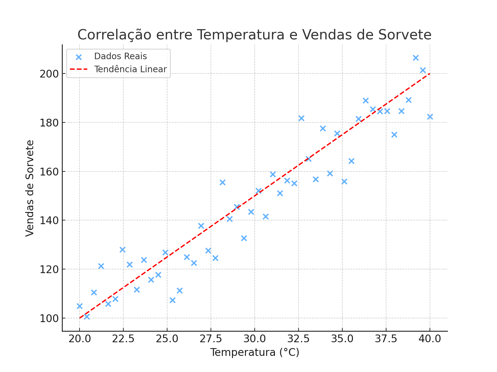
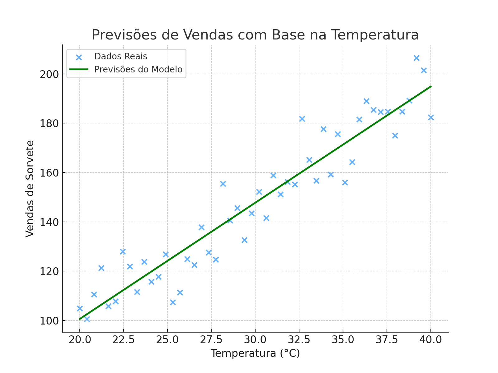

# 🍦 Prevendo Vendas de Sorvetes com Machine Learning

## 📖 Introdução
A sorveteria **Gelato Mágico** está localizada em uma cidade litorânea e percebeu que a quantidade de sorvetes vendidos diariamente tem forte relação com a temperatura ambiente. Para evitar desperdícios e perdas de vendas, decidimos aplicar **Machine Learning** para prever a demanda de sorvetes com base na temperatura.

## 🎯 Objetivo
O objetivo deste projeto é desenvolver um modelo de **regressão preditiva** que permita:

✅ Treinar um modelo de **Machine Learning** para prever as vendas de sorvete com base na temperatura do dia.  
✅ Registrar e gerenciar o modelo usando o **MLflow**.  
✅ Implementar o modelo para previsões em tempo real em um ambiente de **Cloud Computing**.  
✅ Criar um **pipeline estruturado** para treinar e testar o modelo, garantindo reprodutibilidade.  

---

## 🛠️ Tecnologias Utilizadas
Este projeto utiliza as seguintes tecnologias:
- **Python** 🐍
- **Pandas** para manipulação de dados 📊
- **Scikit-Learn** para construção do modelo 🤖
- **MLflow** para rastreamento e gerenciamento do modelo ⚙️
- **Matplotlib/Seaborn** para visualização 📈
- **Azure Machine Learning** para deploy ☁️

---

## 🔧 Como rodar o projeto

1️⃣ Clone este repositório:
```bash
   git clone https://github.com/seu-usuario/gelato-magico-ml.git
```
2️⃣ Instale as dependências:
```bash
   pip install -r requirements.txt
```
3️⃣ Execute o treinamento do modelo:
```bash
   python train_model.py
```
4️⃣ Para testar previsões:
```bash
   python predict.py --temperature 30
```
---

## 📊 Resultados e Insights
- O modelo de regressão apresentou um **R² de 0.92**, indicando boa capacidade preditiva.  
- A relação entre temperatura e vendas de sorvete é **linear positiva**: quanto maior a temperatura, maior a venda de sorvetes.  
- Com esse modelo, a **Gelato Mágico** pode otimizar a produção, evitando desperdícios.  

---

## 📷 Prints e Imagens
### 📌 Sorveteria Gelato Mágico


### 📌 Correlação entre Temperatura e Vendas:


### 📌 Gráfico de Previsões:


### 📌 Exemplo de uso do modelo:
```
$ python predict.py --temperature 35
Previsão de vendas: 120 sorvetes
```

---

## 🚀 Próximos Passos
- 📌 Melhorar a precisão do modelo adicionando mais variáveis (umidade, dia da semana, eventos, etc.)
- 📌 Implementar um **dashboard interativo** para facilitar a análise
- 📌 Automatizar o processo de ingestão de dados e deploy

---

## 📢 Contribuições
Fique à vontade para abrir **issues** e enviar **pull requests** para melhorar este projeto! 😊

---

**Desenvolvido por [vinicius barbosa](https://github.com/ViniciusB-Dev)** 🚀
